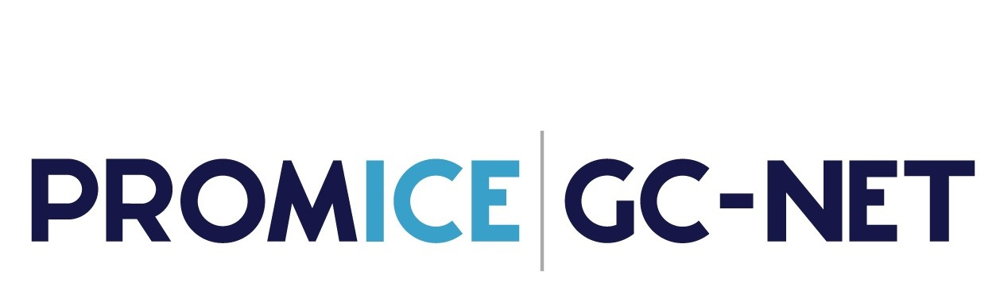

<h1 style="font-size:20px">

<strong>

Example scripts to read, process and plot the SUMup 2023 dataset

 

</h1>

## Python scripts available:
- [Density: reading NetCDF file with xarray](density-netcdf-xarray.py)
- [Density: reading CSV file with pandas](density-csv-pandas.py)
- [Density: Jupyter notebook to read NetCDF files](jupyter-notebook-density.ipynb)

## coming soon:
- [SMB: reading NetCDF file with xarray](smb-netcdf-xarray.py)
- [SMB: reading CSV file with pandas](smb-csv-pandas.py)
- [Temperature: reading NetCDF file with xarray](temperature-netcdf-xarray.py)
- [Temperature: reading CSV file with pandas](temperature-csv-pandas.py)

